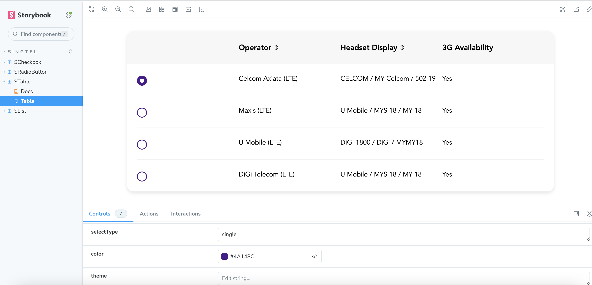
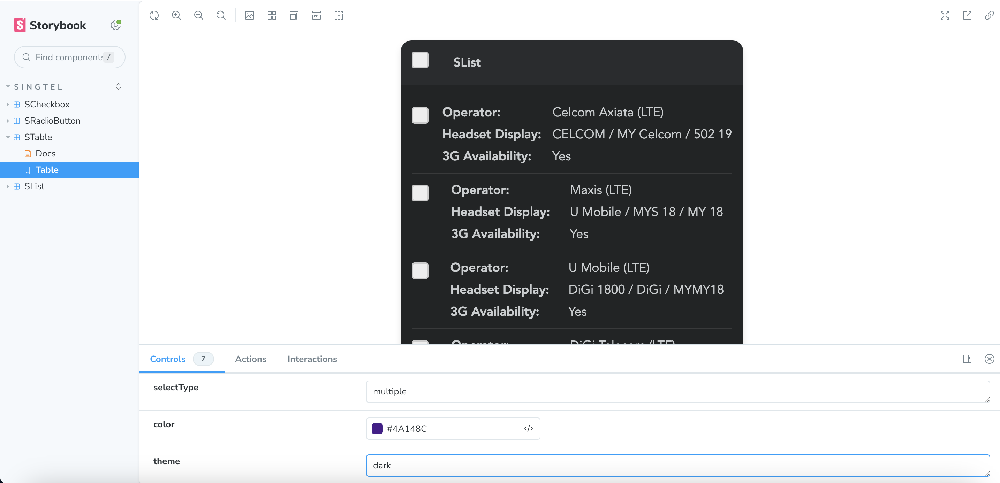

# React Table Component

A flexible and customizable React table component for creating tables with sorting, selection, and responsive list views.

## Table of Contents

- [About](#about)
- [Features](#features)
- [Getting Started](#getting-started)
- [Usage](#usage)
- [Contributing](#contributing)
- [License](#license)

## About

The React Table Component is a versatile table solution for React applications. It provides features like column sorting, row selection, and the ability to switch between table and list views on mobile devices.

## Features

- Column sorting with ascending and descending order.
- Row selection with options for single and multiple selections.
- Responsive design that automatically switches to a list view on mobile devices.
- Customizable table header and body.
- Supports both light and dark themes.

## Getting Started

To use the React Table Component in your project, follow these steps:

1. Clone the repository:

   ```bash
   git clone https://github.com/rahulmeghlan/react-table.git
2. Install dependencies: `npm install`.
   
3. Start the storybook: `npm run storybook`   

## Usage
   ```bash
   import Table from './Table';
   const headers = [
       {label: 'Operator', sortable: true, sortDirection: 'default'},
       {label: 'Headset Display', sortable: true, sortDirection: 'default'},
       {label: '3G Availability', sortable: false, sortDirection: 'default'}
   ];
   
   const rows = [
       {id: 1, data: ['Celcom Axiata (LTE)', 'CELCOM / MY Celcom / 502 19', 'Yes'], selected: false},
       {id: 2, data: ['Maxis (LTE)', 'U Mobile / MYS 18 / MY 18', 'Yes'], selected: false},
       {id: 3, data: ['U Mobile (LTE)', 'DiGi 1800 / DiGi / MYMY18', 'Yes'], selected: false},
       {id: 4, data: ['DiGi Telecom (LTE)', 'U Mobile / MYS 18 / MY 18', 'Yes'], selected: false}
   ];
   
   <STable
               headers={headers}
               rows={rows}
               mobileView={false}
               title="Test Table"
               selectType="multiple"
               color="blue"
               theme="dark"
           />
```
## Sample Table


## Sample List



## Contributing

We welcome contributions from the community. To contribute to this project:

Fork the project.
Create a new branch for your feature or bug fix.
Make your changes and commit them with descriptive messages.
Push your changes to your fork.
Create a pull request to merge your changes into the main repository.

## License
This project is licensed under the MIT License - see the LICENSE.md file for details.

## Acknowledgments
Thanks to the React community for inspiration and support.


This README provides an overview of the React Table Component, how to get started, how to use it in your application, and how to contribute to the project. Customize it further to match your specific project's details and requirements.
